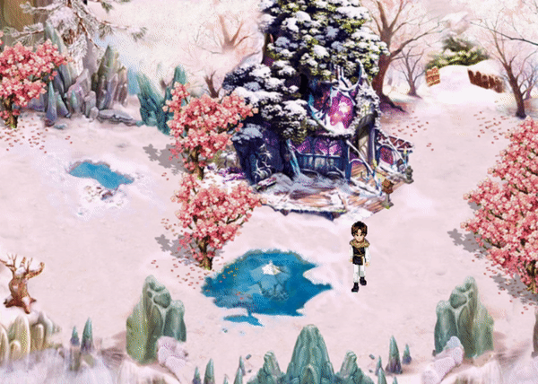

# ASM Game Scene Rough Simulation

A simple game scene drawn with Windows GDI programming methods, written in Assembly (Microsoft MASM).

Image resources are from the Internet, for study purposes only.

Video Demo: [Vimeo](https://vimeo.com/433997021)

Executable File Download: [Google Drive](https://drive.google.com/drive/folders/1pvrJ31HYAc_aQ-KQlb0Es-4HrlDTr9Ub?usp=sharing)

Features:
- The executable file size is as small as 4 KB
- Constructed the window with the entire standard process, including the message loop

---

# 汇编游戏场景简单模拟

使用Windows GDI编程对游戏场景的简单模拟，用汇编语言(Microsoft MASM)编写。

图片素材源自网络，仅用于学习用途。

演示视频：[BiliBili](https://www.bilibili.com/video/BV1Na4y1e7Km/)

可执行文件下载：[蓝奏云](https://wws.lanzous.com/i9hbre8iw8f)

特色功能：
- 生成的可执行文件只有4KB
- 完整的窗口创建流程，包含消息循环
